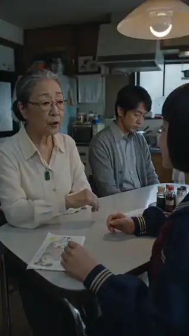
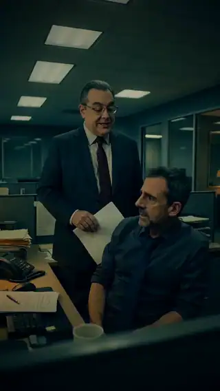

<h1 align="center">🎬 AI Video Drama Creation</h1>

<b>Turn <em>one simple prompt</em> into a finished, coherent, cinematic AI-generated short drama — with <em>zero manual video editing.</em></b>

  
  
  
  

A reusable <a href="https://simular.ai">Sai</a> skill that orchestrates image, reference-to-video, and music models into one repeatable pipeline for short-form narrative video — especially TikTok-style vertical drama.

---

## ✨ See it in action

<i>Two complete short films, produced end-to-end by this pipeline from a prompt. Previews below autoplay (silent) — scroll down to watch either film with sound.</i>

<table align="center"><tr>
<td align="center" width="50%">
   
  <b>Keep It</b> 
  ▶ <a href="https://github.com/zening-cmd/Sai-drama-film-producer/raw/main/samples/Keep-It-final.mp4">Watch full film with sound</a>
</td>
<td align="center" width="50%">
   
  <b>One More Life</b> 
  ▶ <a href="https://github.com/zening-cmd/Sai-drama-film-producer/raw/main/samples/ONE_MORE_LIFE.mp4">Watch full film with sound</a>
</td>
</tr></table>

### ▶️ Watch with sound

<table><tr>
<td width="50%"><b>Keep It</b> <video src="https://github.com/zening-cmd/Sai-drama-film-producer/raw/main/samples/Keep-It-final.mp4" poster="docs/previews/keep-it-poster.jpg" controls muted width="320"></video></td>
<td width="50%"><b>One More Life</b> <video src="https://github.com/zening-cmd/Sai-drama-film-producer/raw/main/samples/ONE_MORE_LIFE.mp4" poster="docs/previews/one-more-life-poster.jpg" controls muted width="320"></video></td>
</tr></table>

---

## Why it's different

- 🎬 **One prompt in, a whole drama out.** Give it a single logline and it becomes the writer — inventing characters, conflict, dialogue, and a satisfying payoff — then produces every asset through to a finished MP4. (Two quick approval checkpoints let you steer the story and the look before any expensive generation runs.)
- 🚫 **No manual editing, ever.** No Premiere, no DaVinci, no timeline scrubbing. Assembly, subtitles, transitions, color grading, and the music mix are all done programmatically.
- ⏱️ **No length ceiling.** Today's reference-to-video models cap a *single* generation at ~15 seconds. This pipeline treats that as a building block, not a wall — it generates many ~15s clips that stay on-model and stitches them into one continuous, full-length film. Want longer? It just orchestrates more clips.
- 🎥 **Actually cinematic, not "AI-pretty."** A concrete film-drama recipe (real camera/lens/film-stock language, motivated lighting, film grain, explicit anti-AI negative prompts) instead of vague "make it cinematic."
- 🔒 **Coherent by construction.** A locked "Look Bible," multi-angle reference sheets, locked generation settings/seed, and a master look anchor keep every clip consistent — so the finished film feels like one production, not a bag of mismatched clips.

## The problem

Generating a *single* AI video clip is easy. Generating a **multi-scene story that actually holds together** is where everything falls apart. Anyone who has tried it hits the same wall of failures:

- **Characters drift between clips** — the same person comes out with a different face, hair, or costume in every separately-generated shot.
- **Locations morph** — a room's furniture, walls, and lighting change from angle to angle because the model re-invents whatever it can't see.
- **Realistic faces get blocked** — reference-to-video models run a face filter that rejects photorealistic faces outright, killing the job.
- **Footage looks "AI-pretty"** — waxy plastic skin, poreless faces, uncanny symmetry, over-polished renders that instantly read as fake.
- **The model bolts on its own music** — reference-to-video models silently synthesize a score, fighting whatever you add later.
- **On-screen detail comes out garbled** — logos, app UIs, screens, and readable text render as mush, the biggest authenticity tell.
- **Silent input bugs waste money** — passing images as base64 (instead of hosted URLs) makes clips morph to black partway through.
- **Clips are capped at ~15s** — so a longer story means stitching many separately-generated clips, which is exactly where continuity breaks down.
- **The story doesn't land** — clips cut mid-sentence, transitions are slapped on everywhere, and the drama has no conflict, stakes, or payoff.

## What this solves

This skill encodes the hard-won fixes for **every** failure above into one ordered, checkpoint-gated pipeline, so coherence comes from the process instead of luck:

- **Full-length film from short clips** — orchestrates and stitches many ~15s clips into one continuous drama, with seams engineered to be invisible (dialogue lands inside each clip; boundaries fall on non-speaking beats).
- **Consistency by construction** — a locked "Look Bible," multi-angle character/location reference sheets, locked settings and seed strategy, and a master look-anchor image.
- **A proven face-filter workaround** — a dense grid overlay on character sheets that passes the filter while the video model reconstructs clean skin beneath it, with a documented escalation ladder.
- **A concrete cinematic recipe** — real camera/lens/film-stock language, motivated lighting, film grain, and explicit negative prompts that defeat the AI look.
- **Audio done right** — clips are generated music-free (with explicit no-score instructions), then scored **once** at the end so music never masks dialogue.
- **In-frame detail via image-first references** — logos, UIs, text, and props are generated/composited as finished isolated assets and passed as references, never left for the video model to invent.
- **Drama that actually works** — deliberate story engineering: open on conflict, one clear goal + obstacle, an early "take a side" moment, a genuinely unlikable antagonist, escalating stakes, a sharp turning point, and a satisfying payoff.

## The pipeline at a glance

| Step | Stage | Output |
|---|---|---|
| **Pre** | Confirm settings (provider, resolution, aspect, runtime, fps, music mood) | Locked config |
| **1** | Rewrite prompt/script into a **production bible** (+ locked Look Bible, voice profiles) | `production-bible.md` |
| **2** | Generate master **reference images** (locations, character sheets, in-frame assets) | `/references/...` |
| **3** | Generate **scene-specific character variants** | scene variants |
| **4** | Generate **video clips** (reference-to-video, with QA + coherence checks) | `/clips/...` |
| **5** | **Assemble** — timeline, subtitles, transitions, unifying grade | edit |
| **6** | Generate and add **background music** (one track, in post) | `final-track.mp3` |
| **7** | **Export** the final MP4 | `/output/final-video.mp4` |

Each step is checkpoint-gated — you approve the bible and the references before any expensive clip generation happens, because bad assets compound downstream.

## Models used

| Role | Model | Hosted on |
|---|---|---|
| Reference-to-video (clips) | ByteDance **Seedance 2.0** | FAL.AI / Atlas Cloud |
| Image generation (references) | **GPT Image 2** | FAL.AI / Atlas Cloud |
| Background music | **MiniMax Music 2.6** | FAL.AI / Atlas Cloud |

An API key for your chosen provider is required. The skill requests it securely and never stores it in plaintext.

## Usage

This is a **Sai skill**. Load [`SKILL.md`](./SKILL.md) in a Sai session (or import it as a skill) and describe the video you want to make in a sentence — the workflow walks through pre-production, asks for the settings it needs, and executes each step with checkpoints along the way.

## Sample films

Full films live in [`samples/`](./samples):

- [`Keep-It-final.mp4`](./samples/Keep-It-final.mp4)
- [`ONE_MORE_LIFE.mp4`](./samples/ONE_MORE_LIFE.mp4)

## License

Licensed under the [Apache License 2.0](./LICENSE).
